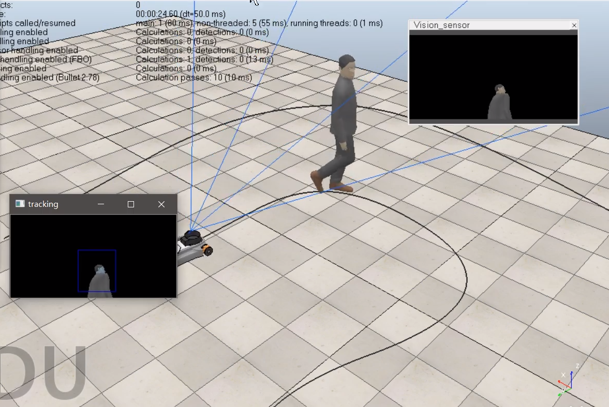

# Simer
这里提供了一个示例，通过搭载RGB相机的麦克纳姆小车对行人进行目标跟踪并控制底盘跟随目标，使用 KCF 跟踪算法。 这里提供了 `Coppeliasim V4.3` 版的示例,注意版本以实际为准。


* 注意：CoppeliaSim 是通过 Python 绑定调用 (`sim.py` 和 `simConst.py`) 和驱动程序库 (`remoteApi.dll`, `remoteApi.dylib`, `remoteApi.so`) 从而实现。通常它们位于 Coppeliasim 安装目录，在开展一个项目时，你需要复制到你需要的项目目录中去。本项目已给出示例。如目录树所示，所有的驱动程序库文件存放在`lib`目录下，并确保有 `sim.py` 和 `simConst.py`


## 运行示例

将 Coppeliasim 安装的路径添加到您的 `PATH`:

- (Windows) 安装路径示例 `C:/Program Files/Coppeliasim/Coppeliasim_PRO_EDU/`

  ```bash
  $ set PATH=%PATH%;C:/Program Files/Coppeliasim/Coppeliasim_PRO_EDU/
  ```

- (Mac OS X) 安装路径示例 `/Users/USERNAME/Coppeliasim_PRO_EDU/Coppeliasim.app/Contents/MacOS/`

  ```bash
  $ export PATH=$PATH:"/Users/USERNAME/Coppeliasim_PRO_EDU/vrep.app/Contents/MacOS/"
  ```

- (Linux) 安装路径示例 `/home/USERNAME/tools/Coppeliasim_PRO_EDU_V3_4_0_Linux`

  ```bash
  $ export PATH="/home/USERNAME/tools/Coppeliasim_PRO_EDU_V3_4_0_Linux":$PATH
  ```

然后执行:

```bash
git clone https://github.com/Derkai52/Coppeliasim-Sample.git

cd sim_python/sample

pip install -e . #(install the Simer package in edit mode)

python3 simpleTest.py #(run the example)
```

最后一个命令将以无 GUI 模式启动 Coppeliasim，并逐步运行简单的模拟。然后它将自行关闭并退出。